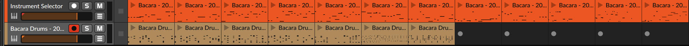

# Bacara Algo

This is a short demo of an two *algo's* (HAPAX speak for Generators). One if patterns (actually ACID Bassline patterns), and one for drums.

To run it, please fist install NodeJS ([here](https://nodejs.org/en/)).

	cd bacara-algo  
	npm install

For Patterns, run:

	MIDI=0 TEMPERATURE=1.0 VELOCITY=100 STEPS=16 node pattern.js

For Drums, run:  

	MIDI=0 STEPS=16 node drums.js

## The Parameters

**MIDI**:   If set to '1', will write the generated notes to a MIDI file  (in either the 'patterns' or 'drums' folder insode 'midi' folder)
        If set to '0', it will not write it
        (default 0)

**TEMPERATURE**: Influences the generated pattern (value between 1.0 and 5.0) (default 1.0)

**VELOCITY**:   The Velocity for 'Normal' (non-accented) notes, only needed when writing MIDI files (default 100)

**STEPS**:  Positive Integer, determines the number of steps (default 16)

**STYLE**: 'all', 'house' or 'breaks' (default 'all')

